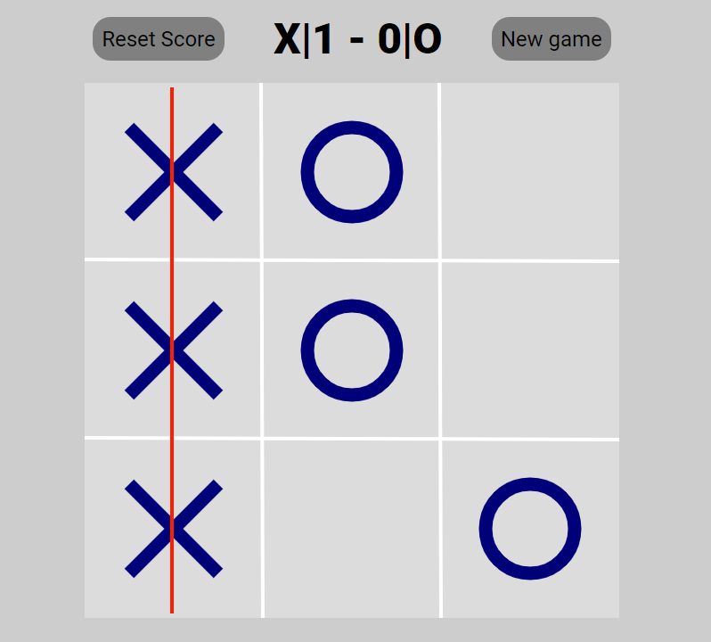

# Jogo da Velha

> Jogo da velha feito em JavaScript.

Jogo desenvolvido usando JavaScript e o recurso Canvas do HTML, simples mas útil para reforçar alguns dos conhecimentos básicos, como manipulação da DOM e uso de pré-processadores CSS.

## 🚀 Acesse o projeto em:

https://thalesms2.github.io/JogoDaVelha

### Ajustes e melhorias

O projeto ainda está em desenvolvimento e as próximas atualizações serão voltadas nas seguintes tarefas:

- [x] Básico do jogo (Posicionar e ganhar)
- [x] Mostrar onde foi feito a vitória
- [x] Botões para começar um novo jogo e resetar pontos
- [ ] Voltar uma jogada
- [ ] Tela inicial
- [ ] Singleplayer contra PC
- [ ] Multiplayer
- [ ] Temas

## 📝 Licença

Esse projeto está sob licença. Veja o arquivo [LICENÇA](LICENSE.md) para mais detalhes.

[⬆ Voltar ao topo](#Jogo-da-Velha) 